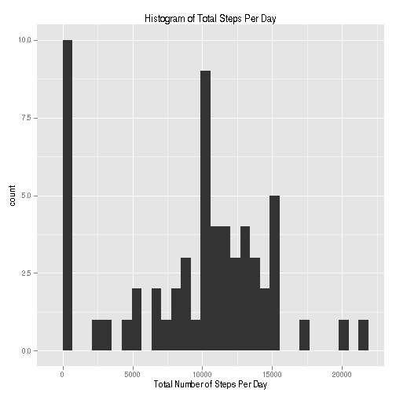
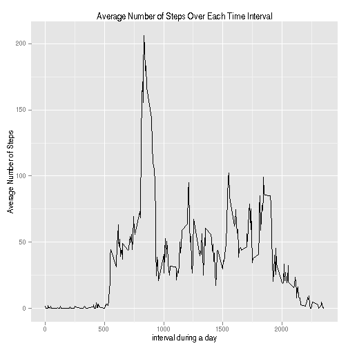
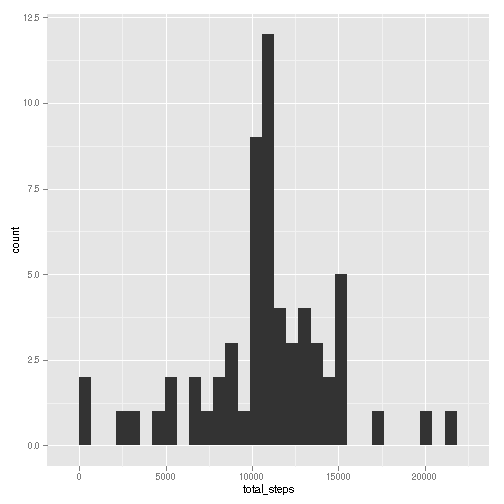
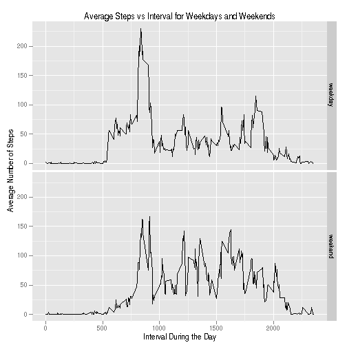

This is Peer Assessment Assignment 1 for the Coursera Reproducible Research class from Johns Hopkins.

Analysis of activity monitoring data from a single individual during the months of October and November 2012. The data consists of the date, 5 minute interval id during the day (from 0 through 2350) and the number of steps taken during that interval.
The data are available in a compressed CSV file, `activity.zip`, with header.

## The Data
Use the `dplyr` package to create a `tbl_df` data object.
This allows easier summary and grouping computations.

```r
require("dplyr")
```

```
## Loading required package: dplyr
## 
## Attaching package: 'dplyr'
## 
## The following objects are masked from 'package:stats':
## 
##     filter, lag
## 
## The following objects are masked from 'package:base':
## 
##     intersect, setdiff, setequal, union
```

```r
activity <- tbl_df(read.csv(unz("activity.zip", file="activity.csv"),
    stringsAsFactors = FALSE))
activity$date <- as.Date(activity$date)
summary(activity)
```

```
##      steps            date               interval   
##  Min.   :  0.0   Min.   :2012-10-01   Min.   :   0  
##  1st Qu.:  0.0   1st Qu.:2012-10-16   1st Qu.: 589  
##  Median :  0.0   Median :2012-10-31   Median :1178  
##  Mean   : 37.4   Mean   :2012-10-31   Mean   :1178  
##  3rd Qu.: 12.0   3rd Qu.:2012-11-15   3rd Qu.:1766  
##  Max.   :806.0   Max.   :2012-11-30   Max.   :2355  
##  NA's   :2304
```

## Steps Per Day
We sum the number of steps for each day. 

```r
require("ggplot2")
```

```
## Loading required package: ggplot2
```

```r
activity_by_date <- group_by(activity, date)
steps_per_day <- summarise(activity_by_date, total_steps=sum(steps, na.rm=TRUE))
# hist(steps_per_day$total_steps)
ggplot(steps_per_day, aes(x=total_steps)) + geom_histogram() +
    xlab("Total Number of Steps Per Day") +
    labs(title="Histogram of Total Steps Per Day")
```

```
## stat_bin: binwidth defaulted to range/30. Use 'binwidth = x' to adjust this.
```

 

```r
mean_steps_per_day <- mean(steps_per_day$total_steps)  # mean steps per day
median_steps_per_day <- median(steps_per_day$total_steps)  # median steps per day
```
The mean number of steps per day is 9354
and the median number of steps per day is
10395.

By ignoring the missing values for steps we have likely biased the counts
per day towards zero since missing values add zero to the total for the day.
This is clear from the large spike around zero in the histogram.

## Steps By Interval

```r
activity_by_interval <- group_by(activity, interval)
interval_average <- summarise(activity_by_interval, ave=mean(steps, na.rm=TRUE),
    med=median(steps, na.rm=TRUE))
ggplot(interval_average, aes(x=interval, y=ave)) +
    geom_line() +
    xlab("interval during a day") +
    ylab("Average Number of Steps") +
    labs(title="Average Number of Steps Over Each Time Interval")
```

 

Find the maximum number of average steps and which interval it appears in:

```r
max_ave <- max(interval_average$ave, na.rm=TRUE)
indx_max_ave <- which(interval_average$ave == max_ave)
max_ave
```

```
## [1] 206.2
```

```r
 activity_by_interval$interval[indx_max_ave]
```

```
## [1] 835
```
The maximum number of average steps is 206.2 and it occurs at
interval 835.


## Missing Values
Look at the pattern of the missing values.


```r
missing_date <- sum(is.na(activity$date))
missing_interval <- sum(is.na(activity$interval))
missing_steps <- sum(is.na(activity$steps))
```

Missing `date` values: 0,
missing `interval` values: 0,
missing `steps` values: 2304.

Only `steps` has missing values, so the total number of missing values is 2304.


```r
nonmissing_steps_per_day <- summarise(activity_by_date,
    nonmissing=sum(!is.na(steps)))
table(nonmissing_steps_per_day$nonmissing)
```

```
## 
##   0 288 
##   8  53
```

```r
length(unique(activity$interval))  # total number of intervals per day
```

```
## [1] 288
```
We see that 8 days have no non-missing values
(all observations are NA),
The other 53 days have no missing values since they all have 288 nonmissing
values which is the number of interval per day.

We will replace any missing value in `steps` with the mean value
for `steps` across all days for the same time interval value.

To compute this imputation:

Get the index (row number) where `steps` is missing.
Match the value of `interval` for theses missing rows
with the value of `interval` in the `interval_average` data frame.
Use the match index value to get the mean step value value to use
in place of the missing value.

```r
indxMissingSteps <- which(is.na(activity$steps))
iactivity <- activity
indxInterval <- match(activity[indxMissingSteps, "interval"],
   interval_average[, "interval"])
iactivity[indxMissingSteps, "steps"] <-
    interval_average[indxInterval, "ave"]
iactivity_by_date <- group_by(iactivity, date)
isteps_per_day <- summarise(iactivity_by_date,
    total_steps=sum(steps, na.rm=TRUE))
ggplot(isteps_per_day, aes(x=total_steps)) + geom_histogram()
```

```
## stat_bin: binwidth defaulted to range/30. Use 'binwidth = x' to adjust this.
```

 

```r
imean_steps_per_day <- mean(isteps_per_day$total_steps)
imedian_steps_per_day <- median(isteps_per_day$total_steps)
```
The mean number of steps per day with imputed data is
10766,
compared to the mean number of steps per day with missing values,
9354.
The median number of steps per day with imputed data is
10766,
compared to 
10395
for the data with missing values.
This is what we expected since we noted above that the missing values would bias the total steps per day towards zero.
We see that median is less sensitive to this bias compared to the mean (i.e. the mean changed the most between the data with missing values and the imputed data)

## Weekday Versus Weekend
Compare the mean number of steps at each interval during the week to the same mean but for the weekend days using the imputed data.

Add a `daytype` factor to the `iactivity` data object with levels `weekend` and
`weekday`.

```r
iactivity$daytype <- ifelse(weekdays(iactivity$date) %in%
    c("Saturday", "Sunday"), "weekend", "weekday")
table(iactivity$daytype)
```

```
## 
## weekday weekend 
##   12960    4608
```

```r
iactivity_by_interval_daytype <- group_by(iactivity, interval, daytype)
interval_average_by_daytype <- summarise(iactivity_by_interval_daytype, ave=mean(steps, na.rm=TRUE))
ggplot(interval_average_by_daytype, aes(x=interval, y=ave)) +
    geom_line() +
    facet_grid(daytype ~ .) +
    xlab("Interval During the Day") +
    ylab("Average Number of Steps") +
    labs(title="Average Steps vs Interval for Weekdays and Weekends")
```

 

On weekdays the steps start to increase earlier in the day (by 6 am) while on the weekend, the number of steps does not start to increase until around 8 am.
The maximum average number of steps in any interval is between 9 am and 10 am on both weekends and weekdays but the maximum average value is much higher on weekdays.
